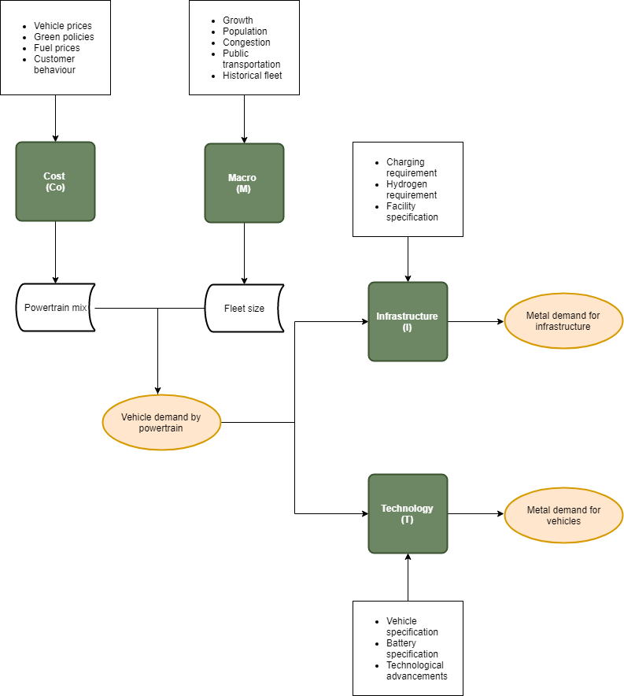
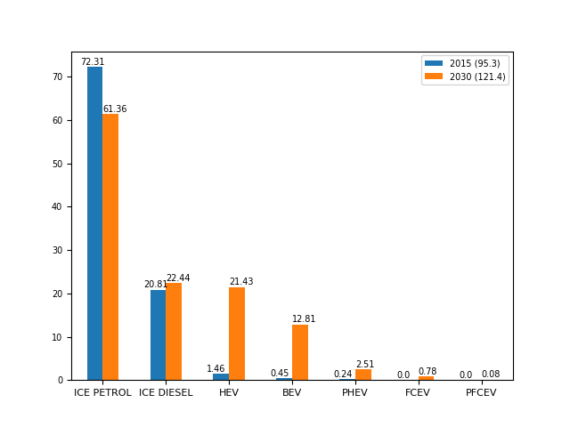

Policy incentives, rising incomes, and technological advancements are anticipated to drive mass adoption of electric vehicles. This is a good news for the climate but poses a number of resource questions. We introduced a Python-based model named CoMIT (Cost, Macro, Infrastructure, Technology) to holistically simulate the impact of e-mobility on demand for mined commodities.

By 2030, we anticipate that the demand for vehicles general will increase by 27.4%, of which 13.3% will be EVs. Our model also predicts a large increase in the demand for certain base metals, including a 37 and 18-fold increase in demand for cobalt and lithium (relative to 2015 levels), respectively. Without major changes in certain technologies, the cobalt and lithium supply chains could seriously constrain the widespread deployment of EVs. Significant demand increases are also predicted for copper, chrome, and aluminium. We also highlight the importance of China in driving demand for EVs and the critical materials needed to produce them.

Forecasted new vehicle sales by powertrain|Forecasted metal demand for new vehicles
:-:|:-:
|
