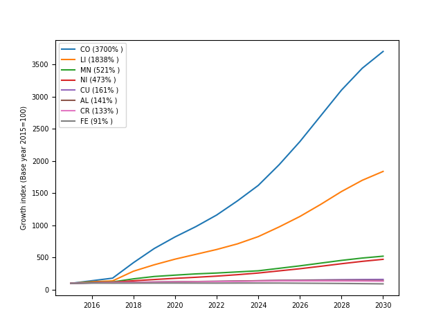

Policy incentives, rising incomes, and technological advancements are anticipated to drive mass adoption of electric vehicles. This is a good news for the climate but poses a number of resource questions. We introduced a Python-based model named CoMIT (Cost, Macro, Infrastructure, Technology) to holistically simulate the impact of e-mobility on demand for mined commodities.

Our model forecasts large increases in demand for certain base metals, including a 37 and 18 fold increase in demand for cobalt and lithium (relative to 2015 levels), respectivelly. We also anticipate significant increase in demand for manganese, nickel, copper, chrome and aluminium. 

Forecasted new vehicle sales by powertrain|Forecasted metal demand for new vehicles
:-:|:-:
|
