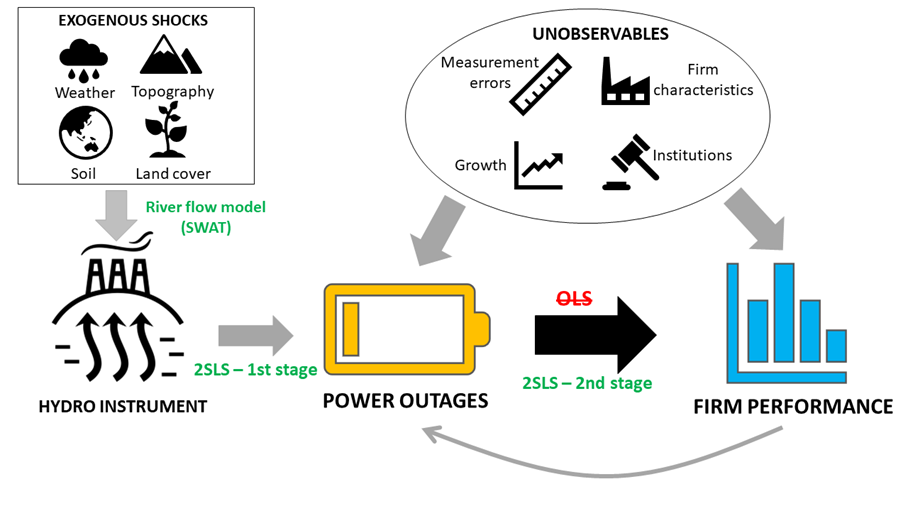

The economy needs power to grow, however, it is not easy to quantify the economic importance of power reliability. There are numerous factors that could affect both firm performance and power quality, however, they are not always observable.  For example, firms are concentrated in places with favourable business environment, making system overload more frequently or high-performing firms are given access to better power supply. The endogeneity concerns mean that a proper treatment is needed to identify the causal relationship between power provision and firm performance. We introduce an interdisciplinary approach that enables an instrumental strategy for hydro-dependent, fast-growing, small countries by combining a riverflow model, an electricity-grid-based distance interpolation technique with power outages data self-reported by firms.

