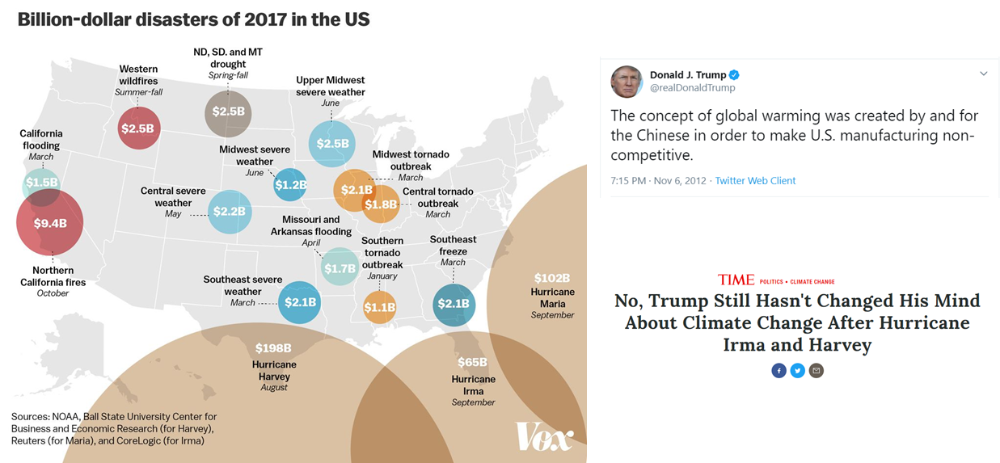
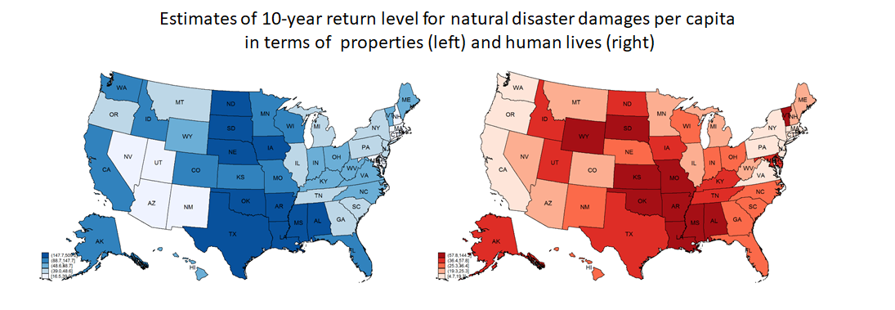
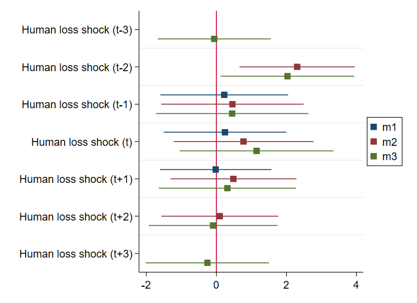
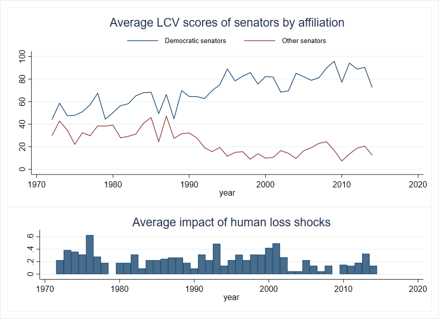

Natural disasters are politically salient events, however, their influence on elite opinion on environemental issues is rarely observed.

We introduce an approach to take into account the extreme value distributions of a range of natural diasters and allow them to vary across space while disentangling their human costs and economic consequences.

Monitoring senatorial scores of roll call votes on environmental legislation and natural disaster losses over a 44 year period, our empirical study shows that  support for environmental legislation increases in response to unusual human losses but does not respond to unusual economic losses. Their reaction in terms of voting for environmental friendly legislation is not immediate and is relatively short-lived.

 
